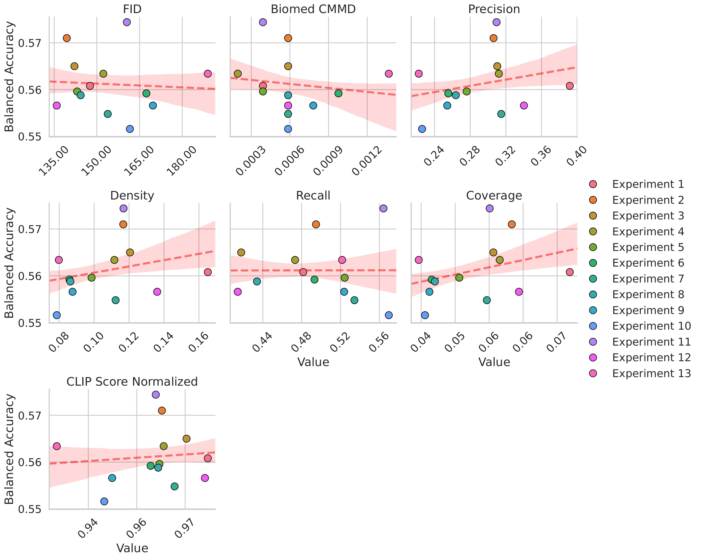

# Generative Data Augmentation for Medical Image Classification

This repository contains the source code and experimental framework developed for my Master's Thesis at **TU Ilmenau**. The project investigates the viability, limitations, and optimal strategies of using **Diffusion-based Generative Data Augmentation** to counter data scarcity and class imbalance in specialized medical diagnostics.

---

## 📌 Project Overview

Obtaining high-quality, legally compliant, and well-labeled medical datasets is notoriously difficult and computationally expensive. This research explores whether synthetic images generated via domain-specific GenAI can serve as a robust data-enrichment tool for downstream machine learning classifiers.

### Key Framework Milestones:
1. **Baseline Evaluation:** Establishing diagnostic baseline performance using an `EfficientNet-B0` architecture with strict lesion-level splitting on the **BCN20000** dataset to prevent data leakage.
2. **Generative Fine-Tuning:** Leveraging Low-Rank Adaptation (LoRA) on top of `Stable Diffusion v1.5` to inject domain knowledge without restructuring the foundational layers.
3. **Advanced Prompt Engineering:** Dynamically mapping clinical text metadata into prompt tokens to maintain high-fidelity lesion features.
4. **Domain-Specific Evaluation:** Utilizing **BioMedCLIP** to bridge the gap between human visual assessment and classifier-specific feature metrics (Density, Coverage, FID, Precision/Recall).

---

## 🛠 Repository Structure & Core Modules

The codebase is organized into modular scripts designed for clean execution of individual pipeline steps:

* `generate_dataset.py` & `generate_dataset_dyn_prompts.py`: Automated generation pipelines. Dynamically parses original metadata distributions, samples text-prompt text-pools, applies negative prompt engineering, and pipes them through the custom LoRA model.
* `balanced_augmentation.py`: Implements rigid minority class balancing scripts across multiple cross-validation folds.
* `all_metrics.py`, `bio_cmmd.py` & `metrics_evaluation.py`: Feature evaluation scripts relying on **BioMedCLIP** and general CV embeddings to benchmark the generative quality.
* `prompts_preparation.ipynb` & `visualisation.ipynb`: Interactive Jupyter notebooks tailored for fast qualitative assessment and prompt structuring.

---

## 🚀 Deep Dive: Dataset Generation & Augmentation

The framework is built around robust and production-ready ML engineering principles. Below is a conceptual workflow of the `generate_dataset.py` logic:

```python
# The script dynamically tracks class distribution, ensuring an exact user-defined augment ratio (e.g., GEN_PERCENT = 0.2)
# Features implemented:
# - Prompt Caching (PROMPTS_CACHE) to minimize slow Disk I/O operations.
# - Strict negative prompt conditioning to suppress artifact generation (rulers, hairs, text, watermarks).
# - Memory Guardrails (torch.amp.autocast & torch.cuda.empty_cache) preventing CUDA Out-Of-Memory exceptions on large batches.
# - Synthetic-to-ISIC Metadata Compiler: Outputs a clean metadata_synth.csv matching ISIC schema format automatically.
```

### Script Execution Example

To generate synthetic data scaled proportionally to the base dataset metrics:

```python
# python generate_dataset.py
```

---

## 📈 Key Research Insights

1. **The Alignment Gap**: High scores in conventional generative metrics (like general FID) do not automatically correlate with downstream classifier gains. Visual realism does not equal statistical utility for an AI model.
2. **Proportional Scaling Wins**: Proportional dataset scaling (integrating synthetic data as 60%–90% of the training set) outperformed rigid minority-class balancing, achieving a +2.4% increase in balanced accuracy over the baseline.
3. **Domain Specificity Matters**: Implementing BioMedCLIP for feature evaluation revealed much clearer correlation trend-lines regarding classifier accuracy compared to standard ImageNet-based Inception encoders.

### Metric Correlation Analysis



---

## 📜 Academic Context & Data Availability

This research project was conducted as part of a Master's Thesis at the **Technische Universität Ilmenau**. 

* **Dataset:** The research utilizes the publicly available **BCN20000** dataset (available via the ISIC Archive). 
* **Weights:** Pre-trained weights for the final fine-tuned LoRA models are omitted due to file size constraints but can be provided for academic replication upon reasonable request.

For academic inquiries, collaboration, or professional networking regarding Generative AI in MedTech, feel free to connect via [LinkedIn](https://www.linkedin.com/in/natalia-shevtsova99/).
